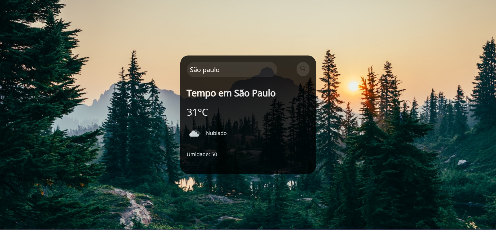

# previsao-do-tempo
projeto previsão do tempo foi feito durante um evento ( você programador) colocando o nome da cidade mostra a previsão do tempo usando API
e a imagem de fundo troca toda vez que a pagina atualiza.

